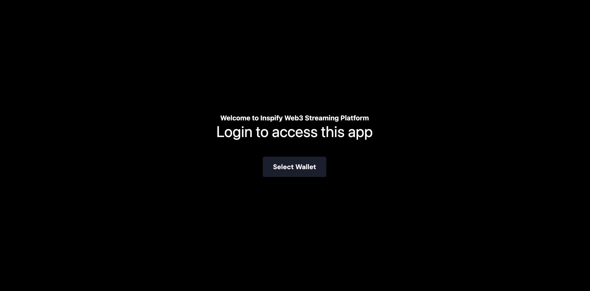
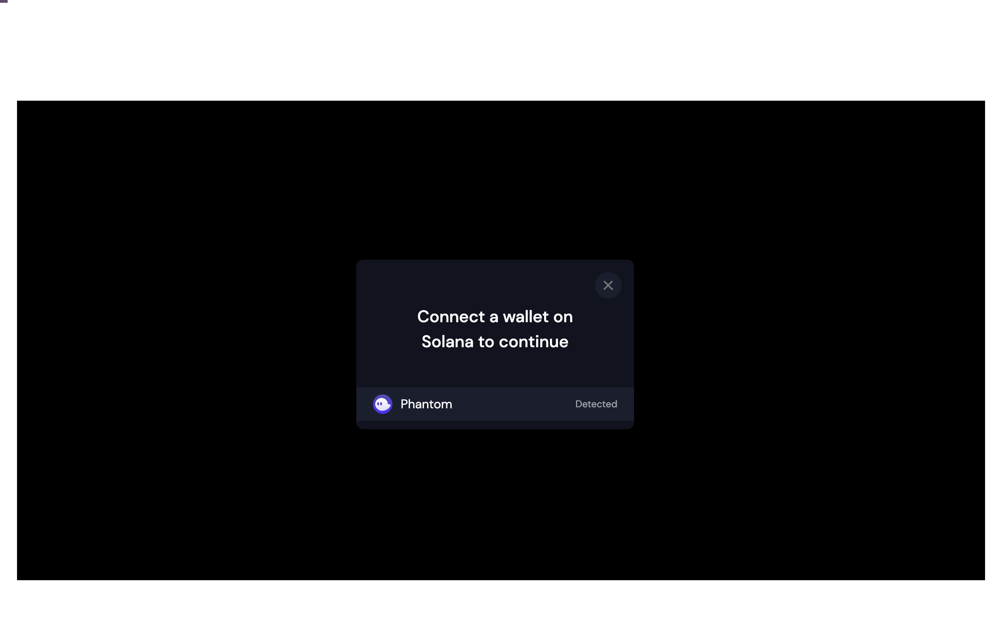
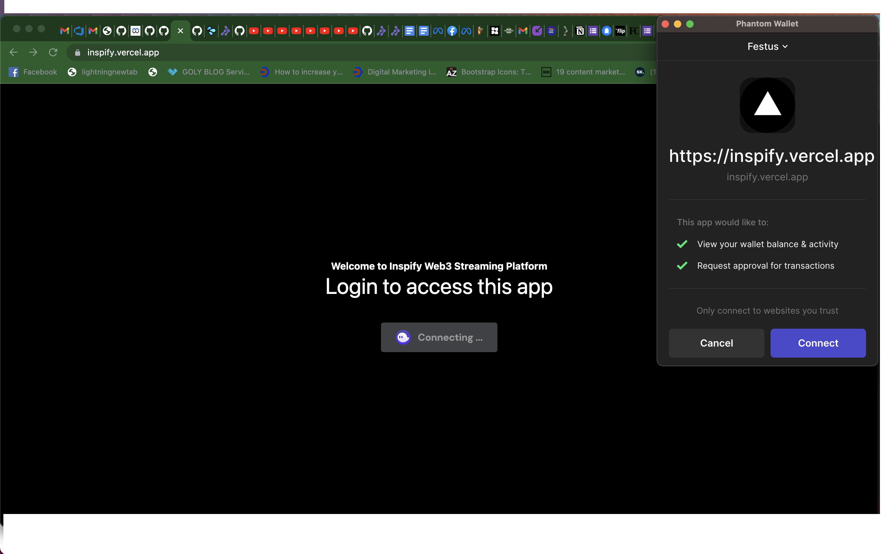
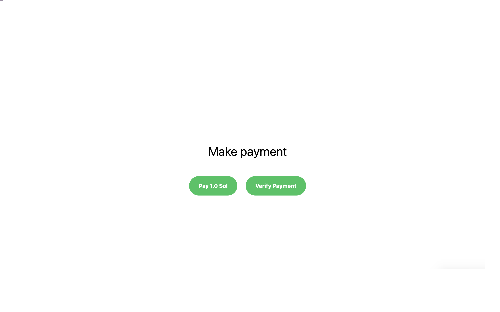
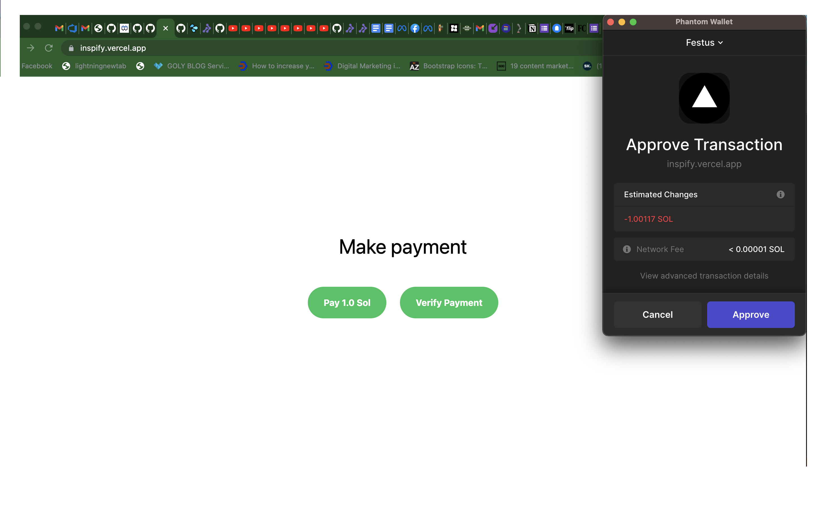
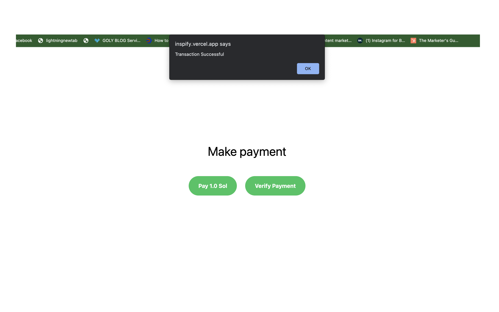
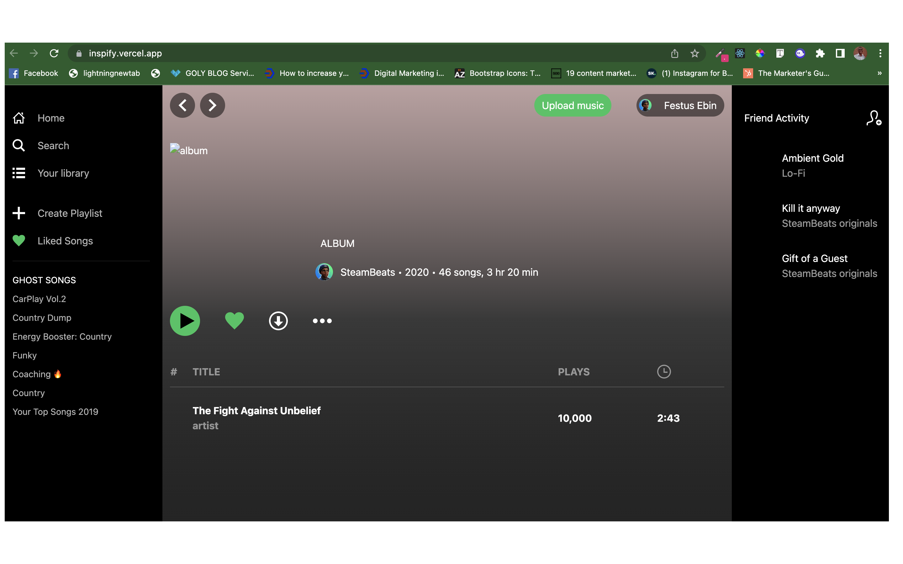

## Inspify Web3

This is a dApp platform built on the Solana blockchain network that allows users to listens to online music, mp3 messages and audio podcast content they love and enjoy from record labels, media companies, and creators across the globe.


## Features

- subscribe to discover different genres 
- a catalogue of music and podcasts
- create and share personalized playlists and experiences for free

## Coming soon

- build profiles
- select favourite artists
- And more features coming your way
- Mobile App

## Technology Used
👉  Building the Spotify Web3 dApp with Next JS
- [Next.js](https://nextjs.org/) project bootstrapped with [`create-next-app`](https://github.com/vercel/next.js/tree/canary/packages/create-next-app)

👉  Creating your program on the Solana Blockchain using Anchor with Rust
- [Rust language](https://docs.rs/anchor-lang/latest/anchor_lang/)

👉  Storing your songs on the Solana blockchain

👉  Use Phantom Wallet to authenticate the users
- [phantom](https://phantom.app/)


## Getting Started

To run the application on your local machine, follow the instructions below;

- Firstly, you need to clone the repo on your local machine

```bash
git clone https://github.com/festusebin/inspify-web3.git
```

- Secondly, you need to install the packages used to enable the blockchain dApp run successfully by;

```bash
npm install && npm run dev
```

- Open [http://localhost:3000](http://localhost:3000) with your browser to see the result.

To follow the development link, follow the instructions below;
- Click on the link https://inspify.vercel.app it takes you to this screen



- Click on the select phantom wallet as seen on the screen below



- Click on connect your phantom wallet and if you don't have the solana's phantom wallet or a sol devnet test account, you can get it here via this link; https://chrome.google.com/webstore/detail/phantom/bfnaelmomeimhlpmgjnjophhpkkoljpa?hl=en and https://solfaucet.com/



- After connecting your wallet to the blockchain, you make a deposit of 1.0 sol token which is the unit for solana asset.


- After clicking on the pay button, you need to approve the transactions as shown on the screen below;


- After the transactions have been approved, you get a successful response message. if otherwise, it means either you don't have money in your devnet wallet or it's connected properly.


- Click the OK button displayed on your screen, and it redirects you to the dashboard
 

